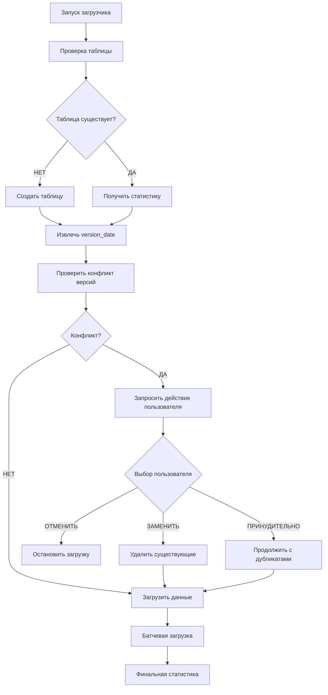

# 🧠 Умный загрузчик RAW слоя - Документация

## 🎯 Основные возможности

### 1. **Защита от дублирования**
- Проверка существующих данных по `version_date`
- Интерактивный запрос при конфликте версий
- Три варианта разрешения конфликтов

### 2. **Умное управление таблицей**
- Автоматическое создание таблицы при первом запуске
- Проверка существования перед созданием
- Накопительное хранение данных

### 3. **Версионное управление**
- Извлечение даты версии из метаданных Excel
- Партиционирование по месяцам `toYYYYMM(version_date)`
- Статистика существующих версий

## 🔄 Логика работы



## ⚙️ Конфигурация

Все настройки хранятся в файле: **`config/database_config.yaml`**

Включает:
- 🗄️ Параметры подключения к ClickHouse
- 📦 Настройки батчевой загрузки  
- 📊 Конфигурацию парсинга Excel
- 📝 Параметры логирования

## 🚨 Обработка конфликтов версий

При обнаружении существующих данных с той же `version_date` система предлагает:

1. **ЗАМЕНИТЬ** - удаление старых данных и загрузка новых
2. **ОТМЕНИТЬ** - прекращение операции без изменений  
3. **ПРИНУДИТЕЛЬНО** - добавление данных (возможны дубликаты)

## 📊 Мониторинг процесса

Система предоставляет детальную статистику:
- 📦 Прогресс батчевой загрузки
- ⏱️ Время выполнения и производительность  
- 📈 Количество обработанных записей
- ✅ Итоговая проверка в базе данных

## 🗂️ Структура данных

### Входные данные (Excel)
- **Файл**: `data_input/source_data/Status_Components.xlsx`
- **Заголовки**: Строка 1 (английские названия)
- **Данные**: Начиная со строки 2
- **Столбцов**: 15 основных полей + метаданные

### Выходная таблица ClickHouse
- **Таблица**: `Status_Components_raw`
- **Движок**: MergeTree с партиционированием по месяцам
- **Поля**: 15 основных + `version_date` для версионирования
- **DDL**: см. функцию `create_table_if_not_exists()` в основном скрипте

## 🔧 Технические детали

### Структура данных Excel
- **Заголовки**: строка 1 уже в правильном формате
- **15 полей**: от `partno` до `ppr`
- **Переименование**: НЕ требуется
- **Код обработки**: см. функцию `prepare_data_for_clickhouse()`

### Обработка данных
- **Даты**: автоматический парсинг с `dayfirst=True`
- **Числа**: конвертация с обработкой ошибок
- **NaN**: замена на `None` для совместимости с ClickHouse
- **version_date**: извлечение из метаданных Excel

### Батчевая загрузка
- **Размер батча**: 5,000 записей (настраивается)
- **Retry логика**: автоматические повторы при сбоях
- **Мониторинг**: детальное логирование прогресса
- **Производительность**: ~44,000 записей/сек

## 🎛️ Использование

### Использование
```bash
# Основной запуск
python3 code/smart_raw_loader.py

# Утилиты обслуживания  
python3 code/utils/check_and_clean_table.py
python3 code/utils/debug_excel_structure.py
```

### Сценарии работы
1. **Первый запуск** - автоматическое создание таблицы
2. **Повторный запуск** - проверка конфликтов версий
3. **Новая версия файла** - добавление без конфликтов
4. **Конфликт версий** - интерактивный выбор действий

### Автоматическая обработка версий
При обновлении Excel файла система автоматически определяет новую `version_date` и добавляет данные без конфликтов. При совпадении версий предлагается интерактивный выбор действий.

## 🛡️ Безопасность и контроль

### Проверки перед загрузкой
1. ✅ Подключение к ClickHouse
2. ✅ Существование/создание таблицы
3. ✅ Валидность Excel файла
4. ✅ Корректность структуры данных
5. ✅ Конфликты версий

### Логирование
- **Консоль**: INFO уровень с эмодзи
- **Файл**: DEBUG уровень (`test_output/smart_loader.log`)
- **Детализация**: Каждый батч, ошибки, производительность

### Откат изменений
При выборе "ЗАМЕНИТЬ" старые данные удаляются **ДО** загрузки новых, что обеспечивает целостность данных.

## 🚀 Готовность к production

✅ **Готово для использования**:
- Защита от дублирования
- Версионное управление
- Интерактивное разрешение конфликтов
- Батчевая загрузка с мониторингом
- Детальное логирование

✅ **Следующие шаги**:
1. Создание CLEANED слоя с оптимизированными типами
2. ETL pipeline для аналитики  
3. Интеграция с Flame GPU моделью (библиотеки готовы ✅)

## 🚀 GPU готовность

**Установленные GPU библиотеки:**
- ✅ **cuDF 25.02.02** - GPU-ускоренная обработка данных
- ✅ **PyFlameGPU 2.0.0rc2** - GPU симуляции и агентное моделирование
- ✅ **CUDA 12.0** поддержка

## 🛠️ Сервисные утилиты

Дополнительные инструменты находятся в папке **`utils/`**:
- 🔧 Maintenance скрипты (очистка дубликатов)
- 🐛 Debug инструменты (анализ Excel структуры)

См. **`utils/README.md`** для подробностей. 