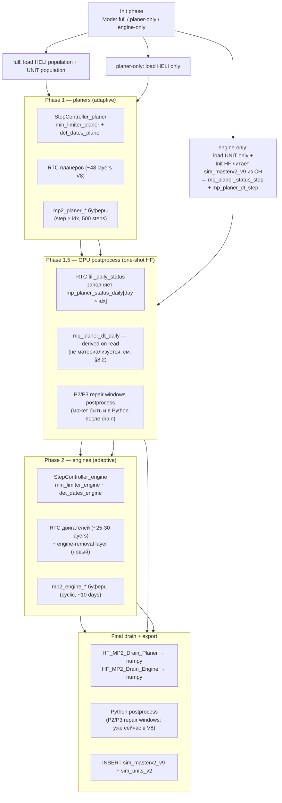

# Симуляция оборота двигателей: архитектура и сравнение подходов FLAME GPU 2

> **Контекст.** Симуляция оборота двигателей (group_by 3 = ТВ2 на Mi-8, group_by 4 = ТВ3 на Mi-17) следующего уровня сборки **multiBOM** на FLAME GPU 2 (pyflamegpu 2.0.0rc4+cuda130). Двигатель — зависимая единица: летает только в составе планера; оборот планеров (master) задаёт оборот двигателей (slave). Документ — read-only анализ архитектурных вариантов перед выбором SSoT-архитектуры.
>
> **Исходные факты.** Production-симуляция планеров — `code/sim_v2/messaging/orchestrator_limiter_v8.py` (LIMITER V8, 48 RTC-слоёв, adaptive steps, MP2 export, RepairLine, MessageBucket). MVP двигателей — `code/sim_v2/messaging/orchestrator_units_v1.py` + `code/sim_v2/messaging/planer_l2_loader.py` (отдельный `ModelDescription`, daily `step()` loop, CH handoff через `sim_masterv2_v9` → `sim_units_v2`, постпроцесс `l2_fullkit_postprocess.py`). SubModel API FLAME GPU 2 в репозитории не используется и в `docs/flame_gpu_capsule.md` не описан.
>
> **Требования пользователя (21-05-2026):**
> 1. Не выходить за пределы GPU при штатной симуляции — обеспечить скорость.
> 2. Три режима запуска: full / planer-only / engine-only.
> 3. В engine-only режиме MP планеров загружается из CH единожды в Init HF.
> 4. У разных агрегатов разный adaptive step — последовательная обработка фаз без выхода из GPU и с переиспользованием готовых MP.
> 5. Двигателям нужны **только daily status и daily dt планера** (не вся MP2-матрица) — постпроцесс на выходе планерной фазы дозаполняет эти два поля.
> 6. Матрица допустимых переходов получает **новый слой** правил снятия двигателей (engine-removal layer, ещё предстоит сформировать).
> 7. Постпроцесс отвечает за дозаполнение части статусов, которые нельзя получить в один прямой проход с adaptive шагами.

---

## 1. Варианты (краткое определение)

| Вариант | Суть | Текущий статус в репо |
|---------|------|-----------------------|
| **A. Single-model multi-agent** | Расширить V8: добавить agent type `UNIT` рядом с `HELI`/`QuotaManager`/`RepairLine` в одном `ModelDescription`; coupling через общие MacroProperty в одном `simulate()` | Не реализовано (паттерн multi-agent доказан на HELI+QM+RL) |
| **B. Two models, ClickHouse handoff** | Две независимые `CUDASimulation` последовательно; обмен через таблицы CH (`sim_masterv2_v9` → loader → `sim_units_v2`) | **MVP реализован** (orchestrator_units_v1 + planer_l2_loader + l2_fullkit_postprocess); валидаторы L2_INV_* есть |
| **C. Two models, in-process MP/file handoff** | Две модели последовательно, MP2 планеров не идёт в CH между прогонами: drain → numpy/parquet → Init HF второй модели | Не реализовано; кирпичи `HF_MP2_Drain` и init HF существуют |
| **D. FLAME GPU 2 SubModel API** | Nested submodel двигателей внутри родительской модели планеров с mapped ports | Не реализовано; не описано в capsule |
| **E. Hybrid GPU-resident two-phase (рекомендуемый)** | Single `ModelDescription`, single `CUDASimulation`; фазы планеров и двигателей последовательно в одном GPU-контексте; между фазами **GPU-side постпроцесс** дозаполняет daily-резолюцию для двух полей; режимы full / planer-only / engine-only через init configuration | Не реализовано; синтез паттернов A + B-only-at-init + GPU postprocess |

---

## 2. Сводная таблица плюсов и минусов

| Критерий | **A** | **B (MVP)** | **C** | **D** | **E (Hybrid)** |
|---|---|---|---|---|---|
| **Стек GPU/CPU** | Один `simulate()` целиком на GPU | Два `simulate()` + CH I/O между ними | Два `simulate()` + numpy drain/push между ними | Один `simulate()` + submodel kernels | **Один `CUDASimulation` целиком на GPU; CH трогается только в Init HF в engine-only режиме** |
| **Готовность кода** | Multi-agent доказан, новый RTC ~30+ функций | Уже работает (MVP Feb 2026) | Glue-обёртка отсутствует | Нулевая база, нет PoC | Multi-agent доказан + переиспользуем `planer_l2_loader.py` как fallback CH-loader; новый StepController + GPU postprocess |
| **Coupling planer↔engine** | Прямой через shared MP | Daily matrix из CH (только на adaptive boundaries — пробелы) | Daily matrix из RAM | Mapped ports submodel | **Прямой; daily-резолюция обоих полей через GPU postprocess** |
| **Temporal coupling / per-phase adaptive** | Один adaptive шаг для всех | Двойная шкала: planer adaptive ↔ engine daily | Двойная шкала через RAM | Submodel наследует adaptive родителя | **Per-phase adaptive: phase 1 использует planer StepController, phase 2 — engine StepController; между фазами daily-резолюция полностью восстановлена** |
| **Feedback engine→planer** | Возможен | Только через второй полный прогон | Только через rerun | Возможен через mapped vars | По умолчанию нет (L2_INV_1); архитектурно возможен в третьей фазе |
| **«Двигатель без планера не летает»** | Естественно | Через CH loader (уже работает) | Через RAM loader | Через mapped vars | **Естественно: engine RTC читает `mp_planer_status_daily` напрямую на GPU** |
| **Постпроцессинг (P2/P3 repair windows, fullkit)** | Один Python-постпроцесс | Два постпроцесса (V8 + l2_fullkit) | Тот же, что A | Один + host postprocess | **GPU-side postprocess (RTC+HF) между фазами + один финальный Python drain после `simulate()`** |
| **Окна ремонта (planer + engine)** | В одном прогоне; согласованность | Гибкая через CH (2-й проход коррекции) | Гибкая через RAM (2-й проход) | Сложно (cross-submodel mapping) | **В одном `simulate()`: planer repair окна формируются в phase 1, dозаполняются в phase 1.5 postprocess; engine repair окна формируются в phase 2 на готовой daily-матрице planer** |
| **MultiBOM multidim матрицы** | 1D linearized MP в одной модели | Через CH-loader | Через RAM-loader | Mapped per-submodel | **1D linearized MP с явной формулой индекса (см. §6)** |
| **Quoting EP1/EP2/EP3/EP4 двигателей** | Новый MessageBucket в той же модели | Отдельный упрощённый QM в units | Аналогично B | Submodel QM | **Отдельный `QM_engine` agent type + `EngineQuotaBucket`; переиспользуется ranking-pattern V8** |
| **Производительность GPU** | Один simulate(), меньше launch overhead | Два simulate() + CH I/O | Два simulate(), без CH I/O | Один simulate() + submodel launches | **Лучший: один simulate(), один RTC compile, ноль host I/O в normal full режиме** |
| **Память GPU** | Растёт в Environment | Изолировано | Изолировано | Изолировано через scope | Растёт в Environment; **детальный budget audit в §10** |
| **RTC-кэш** | Один `.rtc_cache` для всей сборки | Два изолированных кэша | Аналогично B | Один + submodel kernels | Один `.rtc_cache`; правка engine RTC инвалидирует engine-кэш, не planer (если разделены через RTC namespacing) |
| **`MAX_EXPORT_STEPS = 500`** | Унификация под обе фазы | Engines — cyclic buffer | Аналогично B | Зависит от submodel | **Раздельные MP2-буферы: `mp2_planer_*` (500 шагов) + `mp2_engine_*` (cyclic buffer ~10 days)** |
| **GPU-6 (один переход / агент / шаг)** | Соблюдается аккуратной layer order | Тривиально | Тривиально | Нативно в submodel | **Phase mask + FunctionCondition: HELI и UNIT не переходят одновременно в одном RTC** |
| **Изоляция инвариантов** | INV-планерные и L2_INV_* в одной модели | Полная изоляция | Полная изоляция | Через submodel scope | **Phase-локализованные RTC; SQL-first валидаторы остаются изолированными** |
| **Validation pipeline (SQL-first)** | Один прогон → две таблицы | Два прогона → две таблицы | Аналогично C | Один → две таблицы | **Один прогон → две таблицы (`sim_masterv2_v9` + `sim_units_v2`); валидаторы V8 + L2 неизменны** |
| **Отладка** | Сложнее (mixed RTC failures) | Проще (разделено) | Между A и B | Submodel debug сложен | Сложнее, чем B; phase-флаг в логах + раздельные debug counters |
| **Расширяемость group_by 5–42** | Новые agent types раздувают RTC | Новые orchestrators либо unified UNIT | Аналогично B | Каскад submodels | **Один generic agent type `UNIT` с per-`group_by` state machine; новые группы добавляются через config-driven SSoT** |
| **Risk-Tier change cost** | High (вторжение в SSoT V8) | Medium (изолировано) | Medium-High | High | **Medium-High в первой итерации; low в последующих расширениях** |
| **SSoT trans/quota/invariants** | Расширять V8 SSoT | Уже есть `transitions_rules_l2_engines.json` | Аналогично B | Mapping SSoT submodel | **Сохраняем разделение: `transitions_rules.json` (планеры) + `transitions_rules_l2_engines.json` (двигатели, с новым engine-removal слоем); orchestrator читает обе** |
| **`l2_fullkit_postprocess` (synthetic engines)** | Не нужен | Нужен временно | Нужен временно | Не нужен | **Не нужен** — полный EP-cascade в RTC engine quota |
| **Окна ремонта (нюансы постпроцесса)** | Сложна согласованность | Гибкая 2-проходная коррекция | Аналогично B | Сложна | **GPU postprocess между фазами восстанавливает daily-резолюцию; engine читает её как готовый источник** |
| **Совместимость с BI** | Сохранить таблицы | Уже совместимо | Уже совместимо | Аналогично B | **Совместимо: тот же экспорт в `sim_masterv2_v9` + `sim_units_v2`** |
| **Production risk для V8** | **High** | **Low** | Medium | **High** | **Medium**: planer-фаза эквивалентна V8 (numerical parity test); engine-фаза дополняет |
| **Время до first working** | 2–4 недели | Дни | 1–2 недели | 4–8 недель + spike | **3–6 недель** |
| **Запуск без планеров (engine-only)** | Возможен (HELI count=0 + Init HF) | **MVP именно так** | Через CH loader | Submodel attach | **Поддерживается через Init HF + phase mask: planer-фаза skip полностью** |
| **Запуск без двигателей (planer-only)** | UNIT count=0 | V8 как был | V8 как был | Submodel skip | **Поддерживается: engine-фаза skip полностью** |
| **Сохранность готовых MP при смене фазы** | Естественно (один MP scope) | Не применимо | Не применимо | Естественно | **Естественно — MP остаются на GPU; phase-2 читает phase-1 результаты напрямую** |

---

## 3. Развёрнутые плюсы/минусы по каждому варианту

(A/B/C/D — без изменений по сравнению с предыдущей версией. Полные блоки сохранены в git-истории файла.)

### 3.5. Вариант E — Hybrid GPU-resident two-phase (рекомендуемый)

**Плюсы**

- **MP остаются на GPU** между phase-1 (планеры), phase-1.5 (postprocess) и phase-2 (двигатели). Никакого drain/push на host; никакого CH I/O между фазами.
- **Per-phase adaptive** — каждая фаза имеет свой StepController:
  - phase-1: `mp_min_limiter_planer` (атомик-мин по HELI как в V8); deterministic_dates берутся из планерных событий.
  - phase-2: `mp_min_limiter_engine` (атомик-мин по UNIT, отдельный буфер); deterministic_dates берутся из engine-событий + planer status changes.
  - Phases не вложены: phase-2 начинается после полного завершения phase-1 и phase-1.5; adaptive шаги одной фазы не влияют на adaptive шаги другой.
- **Три режима init без дублирования RTC**:
  - `full`: HELI population + UNIT population; phase-1 и phase-2 обе активны.
  - `planer-only`: только HELI; phase-2 skip.
  - `engine-only`: только UNIT; **Init HF читает `sim_masterv2_v9` из CH через `planer_l2_loader.py`** и заполняет daily MP planer-полей; phase-1 и phase-1.5 skip; phase-2 запускается сразу.
- **Phase 1.5 (GPU postprocess) — это ключевое решение**: дозаполняет только два daily-резолюционных MP-поля, не всю MP2-матрицу. Подробно в §8.
- **Engine RTC видит planer на каждый день** — даже если planer adaptive шаги были крупными.
- **MultiBOM multidim — через 1D linearized MP в общем Environment**. Подробно в §6.
- **`l2_fullkit_postprocess` устраняется** — полный EP-cascade в RTC engine quota.
- **BI-схема и SSoT-разделение сохранены**.
- **Validator pipeline неизменен**.
- **Расширяемость на group_by 5–42** — через config-driven `UNIT` с per-group state machine.

**Минусы**

- **Risk-tier Medium-High в первой итерации**: вторжение в `base_model_messaging.py` + новый StepController + phase machinery; нужен parallel testing (V8 standalone vs E full mode — численная эквивалентность по всем INV-1..11).
- **Размер Environment растёт**: GPU memory budget audit в §10.
- **`MAX_EXPORT_STEPS = 500`** — раздельные буферы по фазам; планерный MP2 не теряется.
- **Сложнее отладка mixed-failures**: mitigates через `phase_flag` в логах.
- **Engine-only режим зависит от целостности `sim_masterv2_v9`** в CH — тот же риск, что и B.

---

## 4. Общая рекомендация

С учётом требований «**не выходить за пределы GPU + три режима + per-aggregate adaptive + переиспользование MP + только 2 daily-поля + engine-removal layer**» — **рекомендуется Вариант E**.

A/B/C/D остаются как референс «что мы рассматривали и почему отказались».

---

## 5. Архитектура Варианта E — детальный разбор

### 5.1. Высокоуровневая схема трёх фаз



### 5.2. Phase mask и FunctionCondition

В Environment вводится скалярная переменная `current_phase ∈ {0, 1, 1.5, 2}`. Каждый RTC-слой/HF получает FunctionCondition, проверяющую `current_phase`:

- planer RTC layers: `current_phase == 1`
- postprocess RTC/HF: `current_phase == 1.5` (выполняется ровно один раз)
- engine RTC layers: `current_phase == 2`
- engine-removal layer: `current_phase == 2` (часть phase-2)

**Переключение фаз** делает `HF_PhaseController`:

- В конце phase-1 (когда `current_day >= end_day` или planer ops_count == 0 и нет deterministic event): `current_phase = 1.5`; сбрасывает StepController (`current_day = 0`, `mp_min_limiter = 0xFFFFFFFF`).
- После выполнения postprocess HF: `current_phase = 2`.
- В конце phase-2: `current_phase = 0` (finish).

### 5.3. Единый `simulate()`

Один `CUDASimulation.simulate()` обрабатывает все фазы. Количество adaptive steps в каждой фазе суммируется в общий step counter; **`mp2_day_for_step` и `mp2_phase_for_step` пишутся StepController-ом** для последующего drain.

---

## 6. MultiBOM multidim матрицы через 1D linearized MP

### 6.1. Концепция

FLAME GPU 2 не поддерживает нативные многомерные MacroProperty с динамическим размером — все MP объявляются как 1D с **compile-time константой**. Многомерность достигается через **линейную индексацию** в RTC по формуле от пользователя.

Уже используется в V8:

- `mp5_lin[idx × MAX_DAYS + day]` — 2D (планер × день) налёт
- `mp2_*[step × MAX_FRAMES + idx]` — 2D (шаг × агент)
- В units_v1: `mp_planer_dt[day × MAX_PLANERS + planer_idx]` — 2D (день × планер)

### 6.2. Размерности для multiBOM в Варианте E

Для двигателей и расширений multiBOM:

| MacroProperty | Shape (логический) | Linear size | Назначение |
|---|---|---|---|
| **`mp_planer_status_daily`** | `day × planer_idx` | `MAX_DAYS × MAX_PLANERS = 4001 × 400 = 1_600_400` | Daily статус планера (UInt8 ideal, UInt32 в FG2); заполняется в phase 1.5 |
| **`mp_planer_assembly_trigger_daily`** | `day × planer_idx` | same | Daily assembly_trigger (на дни сборки/разборки планера) |
| **`mp5_lin`** | `planer_idx × day` | same | Уже есть в V8 — daily program flight hours (RO) |
| **`mp_planer_engines`** | `planer_idx × slot` | `MAX_PLANERS × 2 = 800` | engine_idx, занимающий слот (L/R) на планере; обновляется в phase-2 RTC при install/remove |
| **`mp_ac_to_idx`** | `aircraft_number` | `2_000_000` | Уже есть в units_v1 — lookup acn → planer_idx |
| **`mp_engine_planer_slot`** | `engine_idx × 2` (planer_idx, slot) | `MAX_ENGINES × 2 = 80_000` | Двусторонний backlink: где engine стоит. Опционально — slot хранится как переменная agent |
| **`mp_engine_group_count_per_planer`** | `planer × group_by` | `MAX_PLANERS × 50 = 20_000` | Сколько двигателей каждой группы на каждом планере (для completeness check / engine_quota_demand) |
| **`mp_repair_line_engine_*`** | `line_id` × `slot` | `64 × bank` | Engine RepairLine (отдельный пул, если нужен) |
| **MP2 export engine** | cyclic `(step_mod K) × engine_idx` | `K × MAX_ENGINES = 11 × 40000 = 440_000` | Engine MP2 (cyclic drain) |

### 6.3. Index formula (RTC шаблон)

```c
// Двумерная индексация planer-полей (day-major):
const unsigned int pos_planer = day * MAX_PLANERS + planer_idx;

// Slot lookup на планере:
const unsigned int slot_pos = planer_idx * 2u + slot;  // slot ∈ {0, 1} для двигателей
const unsigned int engine_at_slot = mp_planer_engines[slot_pos];

// Inverse lookup для движка (хранится как agent var):
const unsigned int planer_idx = mp_ac_to_idx[engine.aircraft_number];
const unsigned int slot = engine.slot;  // 0 или 1

// Completeness check для группы на планере:
const unsigned int count_pos = planer_idx * MAX_GROUPS + group_by;
const unsigned int installed_count = mp_engine_group_count_per_planer[count_pos];
const unsigned int needed = comp_numbers[group_by];  // PropertyArray
const unsigned int demand = (needed > installed_count) ? (needed - installed_count) : 0u;
```

### 6.4. Расширения для multiBOM 5–42 (редукторы, ВСУ, гидравлика…)

Для перехода от engines-only к полному multiBOM:

- `mp_planer_engines[planer × slot]` → обобщается в **`mp_planer_slots[planer × group × slot_in_group]`**:
  - `pos = planer_idx × (MAX_GROUPS × MAX_SLOT_IN_GROUP) + group_by × MAX_SLOT_IN_GROUP + slot`
  - При `MAX_SLOT_IN_GROUP = 5` (КАУ-30Б ×3, аккум, и т.д.) и `MAX_GROUPS = 50`: `400 × 50 × 5 = 100_000` cells.
- Engine-removal slop (новый transition layer) обобщается в **component-removal layer** для всех групп multiBOM.
- Platform-lock правила (R3 в multibom_template.json: TV2+ВР-8 / TV3+ВР-14) реализуются как RTC FunctionCondition: при попытке установить двигатель в slot 0/1 проверяется группа редуктора в slot 0 группы 12/13.

### 6.5. Память — оценка GPU budget

| Поле | Size (cells × 4B) | Примечание |
|---|---|---|
| Planer существующие MP (V8) | ~30 MB | mp5_lin + mp2_* + repair_line + spawn |
| `mp_planer_status_daily` | **6.4 MB** | 1.6M × 4B |
| `mp_planer_assembly_trigger_daily` | **6.4 MB** | 1.6M × 4B |
| `mp_planer_engines` | 3 KB | 800 × 4B |
| `mp_ac_to_idx` | 8 MB | 2M × 4B |
| Engine agent vars + state buffers | ~10 MB | 40k engines × ~60 vars |
| MP2 engine cyclic | ~20 MB | 11 fields × 440k × 4B |
| Engine completeness MP | 80 KB | 20k × 4B |
| **Итого Variant E full mode** | **~80–100 MB** | Comfortable на RTX 30xx/40xx (8+ GB) |

Полная multiBOM (групп 5–42): +50–100 MB. Всё в пределах comfortable.

---

## 7. Sequential planer → postprocess → engine flow в одном CUDASimulation

### 7.1. Почему один `CUDASimulation`

FLAME GPU 2 не позволяет двум разным `CUDASimulation` экземплярам делить GPU memory / MacroProperty. Если нужно «не выходить за пределы GPU», то:

- **Один** `CUDASimulation` instance
- **Один** `ModelDescription` с обоими agent types (HELI, UNIT) и обоими наборами RTC
- **Один** `simulate()` вызов, который проходит все три фазы

Альтернатива (два разных `CUDASimulation` с in-process MacroProperty handoff) технически требует drain MP в numpy + push обратно в новый instance — это **выход на host**, противоречит требованию.

### 7.2. Phase 1 — планеры

Полностью эквивалентна текущему V8 запуску:

- HELI population загружается из `heli_pandas` через `agent_population_messaging.py`.
- StepController_planer: `current_day += min(min_limiter_planer, det_dates)`.
- 48 RTC слоёв V8 выполняются на каждом adaptive step.
- MP2 пишется в `mp2_planer_*` буферы (sized `MAX_FRAMES × MAX_EXPORT_STEPS`).
- В конце phase-1 `HF_PhaseController` фиксирует `mp2_num_steps_planer`, переводит `current_phase = 1.5`, сбрасывает `current_day = 0`.

**Изменения от V8**: добавлена `current_phase` проверка в FunctionCondition каждого planer RTC; всё остальное эквивалентно (parity-testable).

### 7.3. Phase 1.5 — GPU postprocess (one-shot)

Подробно в §8. Это **набор RTC + HF layers**, выполняющиеся один раз, **не зацикленные через StepController**. Они дозаполняют:

- `mp_planer_status_daily[day × planer_idx]` — daily статус каждого планера.
- (опционально) `mp_planer_assembly_trigger_daily[day × planer_idx]` — daily флаг сборки/разборки.

**Не материализуем**: `mp_planer_dt_daily` — derived on read из `mp5_lin + mp_planer_status_daily` (§8.2).

После завершения phase-1.5: `HF_PhaseController` переводит `current_phase = 2`, сбрасывает `current_day = 0`, `mp_min_limiter_engine = 0xFFFFFFFF`.

### 7.4. Phase 2 — двигатели

- UNIT population загружается из `heli_pandas` (фильтр `group_by ∈ {3, 4}`) через `agent_population_units_v1.py` (или расширение).
- StepController_engine: `current_day += min(min_limiter_engine, det_dates_engine)`.
- RTC engine слои (см. §9 — список):
  - Save pre-state
  - Sync с планером (рефактор `rtc_units_planner_sync_v1.py` — теперь читает `mp_planer_status_daily` по реальному дню, не по step counter)
  - **Engine-removal layer (новый)** — §9
  - Engine increment (sne/ppr из `mp5_lin` через guard)
  - Engine quota (EP1/EP2/EP3/EP4)
  - Engine repair_line (опционально, если есть пул)
  - Spawn двигателей (по дефициту comp_number)
  - MP2 engine writer
  - Engine limiter (atomic min)
- MP2 пишется в `mp2_engine_*` cyclic buffer; drain в numpy каждые ~10 шагов через `HF_MP2_Drain_Engine`.

### 7.5. Final phase — drain + Python postprocess + CH export

- `HF_MP2_Drain_Planer` (запускается одной из `addExitFunction`) — копирует `mp2_planer_*` → numpy.
- `HF_MP2_Drain_Engine` уже работал по cyclic drain в phase-2; финальный drain собирает остатки.
- Python `_postprocess_promotions` (V8) — без изменений, на planer numpy.
- Python L2 валидаторы / engine postprocess (если нужны) — на engine numpy.
- INSERT в `sim_masterv2_v9` + `sim_units_v2`.

### 7.6. Engine-only режим

- `HELI population = 0` — phase-1 и phase-1.5 не выполняют ничего полезного (но HF_PhaseController пропускает их через FunctionCondition).
- В Init HF: `load_planer_signals(...)` (из `planer_l2_loader.py`) читает `sim_masterv2_v9` из CH и заполняет:
  - **`mp_planer_status_step[step × idx]`** + **`mp2_day_for_step[step]`** — adaptive-резолюция из CH, как сейчас в planer_l2_loader.
  - phase-1.5 GPU postprocess преобразует adaptive → daily, как и в full режиме (тот же RTC — переиспользуется!).
  - **Альтернатива**: в engine-only Init HF сразу пишем `mp_planer_status_daily` (CPU-side daily reconstruction в `load_planer_signals` перед push в GPU). Это упрощает phase-1.5 (skip), но переносит работу на CPU — приемлемо для одноразового init.
- phase-2 запускается на готовых MP без участия planer-сим.

### 7.7. Planer-only режим

- `UNIT population = 0` — phase-2 не выполняет ничего.
- phase-1 и phase-1.5 идут как обычно.
- Результат — только `sim_masterv2_v9` (как в текущем V8).

---

## 8. Phase 1.5 — GPU postprocess: дозаполнение daily-резолюции

### 8.1. Проблема

После phase-1 у нас есть `mp2_planer_*[step × idx]` — состояние планера на **end-day каждого adaptive step**. Между шагами (например, день 0..50, потом скачок на 51..220) статус **не явный** — он формально константен (planer не менял состояние внутри adaptive интервала, потому что StepController вычислил min_limiter и det_dates), но engine RTC должен иметь возможность читать `status[day × idx]` для **любого** day.

### 8.2. Решение: только два derived поля

**Что нужно engine RTC:**

1. **`mp_planer_status_daily[day × idx]`** — daily статус планера. Это нужно явно материализовать, так как engine читает на каждый day.
2. **`mp_planer_dt_daily[day × idx]`** — daily налёт планера. **НЕ материализуется**: derived on-read:
   ```c
   const unsigned int status = mp_planer_status_daily[d * MAX_PLANERS + idx];
   const unsigned int program_dt = mp5_lin[idx * (MAX_DAYS+1) + d];  // already daily
   const unsigned int actual_dt = (status == 2u) ? program_dt : 0u;
   ```

**Почему так**: `mp5_lin` уже хранит daily программу полётов (uploaded в init). `actual_dt = program_dt` если planer в ops, иначе 0. Это вычислимо без отдельного MP — экономит **6.4 MB GPU memory** и весь write bandwidth.

### 8.3. RTC реализация phase-1.5 fill

Один RTC HF (host-side helper, не нужно RTC на агентах планеров) выполняется один раз:

```python
class FillDailyPlanerStatusHostFunction(fg.HostFunction):
    def run(self, FLAMEGPU):
        mp2_status = FLAMEGPU.environment.getMacroPropertyUInt("mp2_planer_status_id")
        mp2_day_for_step = FLAMEGPU.environment.getMacroPropertyUInt("mp2_day_for_step")
        mp2_num_steps = FLAMEGPU.environment.getMacroPropertyUInt("mp2_num_steps_planer")[0]
        mp_status_daily = FLAMEGPU.environment.getMacroPropertyUInt("mp_planer_status_daily")
        
        # Для каждого планера, для каждого adaptive step, заполнить дни [day_step_S, day_step_S+1)
        for idx in range(num_planers):
            current_status = 1  # initial inactive
            day_prev = 0
            for s in range(mp2_num_steps):
                day_s = mp2_day_for_step[s]
                # Заполнить [day_prev, day_s) текущим статусом
                for d in range(day_prev, day_s):
                    mp_status_daily[d * MAX_PLANERS + idx] = current_status
                # На самом day_s обновляем статус
                current_status = mp2_status[s * MAX_FRAMES + idx]
                mp_status_daily[day_s * MAX_PLANERS + idx] = current_status
                day_prev = day_s + 1
            # Хвост до конца горизонта
            for d in range(day_prev, MAX_DAYS):
                mp_status_daily[d * MAX_PLANERS + idx] = current_status
```

**На GPU**: это можно сделать как одно RTC ядро с per-day или per-(day,idx) thread; алгоритм скан простой. Альтернатива — Python в HF (работает на host, читает/пишет MacroProperty через FG2 API). Для phase-1.5 одноразовый Python в HF приемлем (~50ms на 400 планеров × 200 шагов).

### 8.4. Постпроцесс P2/P3 repair windows

Текущий V8 Python `_postprocess_promotions` (orchestrator_limiter_v8.py строки 1338+) перезаписывает status_id=4 для P2/P3 окон ремонта. В Варианте E эта логика:

- **Опция A**: остаётся как Python после финального drain — режим, как сейчас. Минус: эта коррекция не отразится в `mp_planer_status_daily`, который engine читал до finalize.
- **Опция B (рекомендуется)**: postprocess репэйр-окон выполняется в phase-1.5 на GPU (RTC, читает claim metadata, перезаписывает `mp2_planer_status_id` для шагов в окне), затем заполняется `mp_planer_status_daily`. Engine видит уже скорректированную картину.

Опция B — лучше, но требует переписи `_postprocess_promotions` на RTC. Это **значительная работа**, нужно отдельно оценить.

### 8.5. Что НЕ дозаполняется

Принципиально:

- **Только** `mp_planer_status_daily` материализуется.
- **`dt` derived на лету** — не пишется в отдельный daily MP.
- **Все остальные поля MP2** (sne, ppr, limiter, repair_days, и т.д.) остаются adaptive-резолюции в `mp2_planer_*` и не нужны engine в daily-резолюции.

Это **отвечает требованию пользователя**: «нам нужны только эти две переменные, а не весь массив, иначе таблица вырастет и мы получим увеличением времени записи».

---

## 9. Engine-removal layer — новый слой матрицы переходов

### 9.1. Постановка

Сейчас в `rtc_units_planner_sync_v1.py` единственное правило «когда снимать двигатель» — `planner_status==4 OR assembly_trigger>0` (т.е. при ремонте планера). Этого **недостаточно** для производственной симуляции. Нужны дополнительные правила:

| Триггер снятия | Source state | Target state | Источник логики |
|---|---|---|---|
| **Двигатель достиг LL** (engine.sne ≥ engine.ll) | ops | storage (списание) | Текущий код частично есть |
| **Двигатель достиг OH** (engine.ppr ≥ engine.oh) | ops | unserviceable → repair | Аналог планерного OH-пути |
| **Двигатель достиг BR** (engine.ppr ≥ engine.br) | ops/unserviceable | storage (списание) | По экономике |
| **Плановое снятие на ТБО** | ops | repair (после daily check) | Новые правила — TBD |
| **Плановое снятие на капремонт** | ops | repair (при появлении WO) | Из AMOS WO; не моделируется сейчас |
| **Каннибализация** (двигатель снят для замены на другом планере) | ops | serviceable | Quota-driven; новое правило |
| **Превышение календарного срока хранения** | serviceable | storage / выходит на ТБО | TBD |
| **Принудительное снятие при ремонте планера** | ops/svc/reserve | serviceable (pool) | Уже есть |
| **Снятие при списании планера** (group_by 1/2 → 6) | любое | storage / serviceable | Должно быть, но проверить |
| **Snятие при storage планера** (group_by 1/2 → 6) | любое | свой подход — TBD | TBD |

### 9.2. Где в SSoT

Слой `engine_removal_rules` добавляется в **`config/transitions/transitions_rules_l2_engines.json`** как новая секция:

```json
{
  "engine_removal_rules": {
    "version": 1,
    "description": "Правила снятия двигателей с борта (multiBOM L2)",
    "rules": [
      {
        "id": "ER1_ll_exhausted",
        "trigger": "engine.sne >= engine.ll",
        "source_state": "operations",
        "target_state": "storage",
        "detach": true,
        "priority": 1
      },
      ...
    ]
  }
}
```

Полная разработка SSoT engine-removal — отдельный workflow (medium-risk), требует Алексея в качестве gate. Архитектурно в Варианте E этот слой:

- **Реализуется как отдельный RTC layer в phase-2**, после `layer_units_planner_sync` и перед quota.
- **Читает SSoT** через `EngineRemovalRulesLoader` (JSON → MacroProperty / PropertyArray с правилами).
- **Соблюдает GPU-6**: на одном step двигатель проходит максимум один removal-переход.

### 9.3. Postprocess для engine-removal

Часть правил (например, daily календарное снятие на ТБО) не может быть проверена в один прямой проход с adaptive шагами — между шагами engine может «перескочить» через дату ТБО. Postprocess для engine аналогичен planer'у:

- В phase-2.5 (опционально) — GPU HF, читающее adaptive-резолюционный engine MP2 и заполняющее daily-резолюцию engine status (если нужно для downstream).
- Это **симметрия с phase-1.5** для планеров.

В первой итерации Варианта E phase-2.5 можно опустить, если engine BI-таблица `sim_units_v2` устраивает в adaptive-резолюции.

---

## 10. GPU memory + RTC cache budget

### 10.1. GPU memory

(см. §6.5)

- Variant E full mode: ~80–100 MB MacroProperty + Environment + agent vectors.
- Engine population 40k агентов × ~60 vars × 4B = 9.6 MB.
- Comfortable budget — на RTX 30xx/40xx (8+ GB) занимает <2%.

### 10.2. RTC cache

- Один `.rtc_cache` для всей сборки.
- Planer RTC namespace: `rtc_v8_*` (~73 функций).
- Engine RTC namespace: `rtc_units_*` (~25–30 функций).
- Phase-1.5 HF — Python, не RTC.
- Engine-removal RTC — новые, ~5–10 функций.
- Правка engine RTC не должна инвалидировать planer cache (если RTC source strings разделены по namespace).

### 10.3. MAX_EXPORT_STEPS

- planer phase: ≤500 adaptive steps (как в V8).
- engine phase: cyclic buffer ~10 дней — без cap (drain в numpy каждые 10 шагов).

---

## 11. Открытые вопросы (для финализации перед `CreatePlan`)

1. **Engine-only init: daily reconstruction где?** На CPU в `planer_l2_loader.py` (расширить функцию до daily) или на GPU (тот же phase-1.5 RTC переиспользуется)? Второй вариант — DRY, но требует push adaptive-резолюционных данных в `mp2_planer_*` буферы как «искусственный результат phase-1».
2. **P2/P3 repair windows postprocess — Python или GPU?** Текущий V8 на Python (после drain). В Варианте E — переписать на GPU phase-1.5 RTC (чтобы engine видел скорректированную картину) или оставить на Python (но тогда engine видит сырой adaptive MP2)?
3. **MAX_PLANERS для daily MP** — оставить 400 (как в planer_l2_loader) или поднять с учётом spawn (до 800+)? Сейчас V8 `RTC_MAX_FRAMES=400` уже включает spawn reserve.
4. **`mp_planer_assembly_trigger_daily` нужен?** Или достаточно вывести из `mp_planer_status_daily` (4 → repair window detected → trigger)?
5. **Engine-removal SSoT** — кто пишет первую версию `engine_removal_rules` секции `transitions_rules_l2_engines.json`? Пользователь предоставит правила или ожидается, что архитектор предложит draft на согласование?
6. **Slot model L/R** — добавлять `slot ∈ {0,1}` в первой итерации или оставить «двигатель просто на борту, без позиции»?
7. **Платформенный замок** (R3 multibom: TV2+ВР-8 / TV3+ВР-14) — реализуем сразу через `mp_planer_engines + mp_planer_gearboxes` или только engines L2 в первой итерации?
8. **Engine repair_line** — отдельный пул или сразу разделить SSoT по группам? Сейчас планерный repair_line в V8 не различает группы (`group_by 1/2`).

---

## 12. Ссылки

- Production планеры: `code/sim_v2/messaging/orchestrator_limiter_v8.py`
- MVP двигатели: `code/sim_v2/messaging/orchestrator_units_v1.py`
- Base model двигатели: `code/sim_v2/messaging/base_model_units_v1.py`
- Loader planer→engine: `code/sim_v2/messaging/planer_l2_loader.py`
- Planner sync RTC: `code/sim_v2/messaging/rtc_units_planner_sync_v1.py`
- MP2 export planer: `code/sim_v2/messaging/rtc_mp2_export.py`
- MP2 drain units: `code/sim_v2/messaging/mp2_drain_units_v1.py`
- Postprocess fullkit: `code/sim_v2/messaging/l2_fullkit_postprocess.py`
- _postprocess_promotions: `code/sim_v2/messaging/orchestrator_limiter_v8.py` строки 1338+
- SSoT L2 transitions: `config/transitions/transitions_rules_l2_engines.json`
- SSoT L2 quota: `config/transitions/quota_rules_l2_engines.json`
- multiBOM каталог: `config/transitions/multibom_template.json`
- Design RTC агрегатов: `docs/architecture/rtc_components.md`
- FLAME GPU capsule: `docs/flame_gpu_capsule.md`
- LIMITER V8 capsule: `docs/limiter_v8_capsule.md`
- Completeness check: `docs/architecture/completeness_check.md`
- Field traceability: `docs/field_traceability_amos_to_sim.md`
- **Эмпирический smoke-тест rc4**: `code/sim_v2/tests/smoke_mp_persistence.py` (см. §13)

---

## 13. Эмпирическая верификация rc4 (smoke-test 2026-05-26)

> **Контекст.** До прогона smoke-теста утверждения §3–§7 о реализуемости Вариантов C / D / E опирались на чтение исходников FLAME GPU 2 (ветка master). Smoke `code/sim_v2/tests/smoke_mp_persistence.py` эмпирически проверил поведение **установленной** на машине разработки версии `pyflamegpu 2.0.0rc4+cuda120` на 12 экспериментах A–J и зафиксировал, какие архитектурные предположения подтвердились, какие опровергнуты, а какие остались непроверенными из-за блокера среды.

### 13.1. Сводка результатов

| Эксперимент | Гипотеза | Результат | Архитектурное следствие |
|---|---|---|---|
| **A** | MP переживает повторный `simulate()` без `reset()` | **PASS** (r1=r2=111) | Фундамент для C и для одно-`simulate()` Варианта E (фазы через слои) подтверждён |
| **B** | `sim.reset()` обнуляет MP | **FAIL — КОНТР-ФАКТ к гипотезе** (после reset MP=111, env-property правильно сброшена в default) | **`reset()` в rc4 НЕ трогает MacroProperty.** Затереть MP можно только явной HostFunction-записью (init или layer-HF). Перепроверено независимым host-only репро |
| **C** | Init-функции прогоняются повторно на каждом `simulate()` | **PASS** (guarded=111, unguarded=888) | Подтверждает требование §5.2: planer init-функции **обязаны** быть под `current_phase` guard'ом — иначе двигательная фаза перетрёт planer-данные |
| **D** | Step counter накапливается между `simulate()` | **PASS** (10 → 20) | В одно-`simulate()` Варианте E `mp2_day_for_step` и `mp2_phase_for_step` корректно индексируются единым счётчиком |
| **E** | Разные `CUDASimulation` изолированы по MP | **PASS** (simB=0) | Подтверждает §7.1: между двумя `CUDASimulation` обмен данных в GPU-памяти невозможен — нужен явный host roundtrip |
| **F / G / H** | (RTC-зависимые) | **N/A — заблокированы средой** | См. §13.4 |
| **I-1** | Запись MP из device-буфера (CuPy / `__cuda_array_interface__`) без хоста | **FAIL** (`HostMacroProperty*` в rc4 не имеет `__cuda_array_interface__`; cupy недоступен из-за CUDADriverError на Blackwell) | **«Загрузка входа прямо с GPU» в pyflamegpu rc4 недоступна.** Любая заливка MP с хоста идёт через CPU. Это убирает один из теоретических путей оптимизации Варианта C |
| **I-2** | Изоляция MP между разными `ModelDescription` | **PASS** (simB(модель B).mp2 = 0) | Усиливает §7.1: даже две разные модели не делят GPU-память автоматически |
| **I-3** | SubModel с mapped MacroProperty разделяет GPU-память | **N/A — заблокирован средой** | API в rc4 присутствует (`newSubModel`, `mapMacroProperty`, `autoMapMacroProperties`, `bindAgent`, `setMaxSteps`); код PoC написан и валидирован reviewer'ом — заработает сразу после починки RTC |
| **I-4** | Цена хостового roundtrip mp2 | **PASS — измерено**: планерный масштаб (88 000 ячеек) ≈ 42–43 мс через python for-loop; экстраполяция × 545 на 30 агрегатов ≈ **23 c** | Это **консервативная** оценка (python-цикл); нативный numpy bulk get/set был бы существенно быстрее (вероятно <5 c). Цена «отступного» Варианта C — известна и приемлема |
| **J** | Submodel-сборка целиком (PoC трёхфазной архитектуры) | **N/A — заблокирован средой** | Код двух вариантов (J-host / J-device, J-1/J-2/J-3) уже написан в smoke-тесте и валидирован — после починки RTC даст ответ о реализуемости Варианта D |

### 13.2. Подтверждения архитектурных утверждений документа

- **§7.1 «FLAME GPU 2 не позволяет двум разным `CUDASimulation` делить GPU memory / MacroProperty»** — подтверждено эмпирически (E + I-2 PASS).
- **§7.1 «drain в numpy + push обратно — выход на host, противоречит требованию»** — подтверждено: I-1 FAIL (нет device-aware host setter), I-4 даёт цену хостового пути.
- **§5.2 «каждый RTC-слой/HF получает FunctionCondition, проверяющую `current_phase`»** — необходимость подтверждена C: init без guard'а перетирает данные на следующем `simulate()` (unguarded init записал 888 поверх 222).
- **§5.3 «количество adaptive steps в каждой фазе суммируется в общий step counter»** — подтверждено D.

### 13.3. Контр-факт и операционные находки

- **`sim.reset()` в pyflamegpu 2.0.0rc4 НЕ обнуляет MacroProperty.** Документ нигде не опирается на `reset()` явно, но это знание **обязательно к учёту** в любых будущих сценариях переиспользования `CUDASimulation` instance между прогонами. Стоит подтвердить в FLAME GPU 2 issue tracker — это документированное поведение rc4 или баг.
- **`HostMacroProperty*` API rc4 узок** — `get/set/zero` + индексация; нет `__cuda_array_interface__`. Любая загрузка из CuPy-буфера в MP проходит через CPU.
- **MP должны явно затираться** на смене фазы там, где это критично (например, MP2 буферы adaptive-резолюции между phase-1 и phase-2). `reset()` здесь не помощник — нужны explicit `HF_ClearMP` слои.

### 13.4. Environment blocker (на момент 2026-05-26)

- **GPU**: NVIDIA RTX PRO 6000 Blackwell, `compute_cap = 12.0 → sm_120`.
- **Установлено**: `pyflamegpu 2.0.0rc4+cuda120` (не cuda130, как указано в шапке документа в §контекст).
- **Авто-arch**: pyflamegpu rc4 выставляет `-arch=sm_120` по compute_cap GPU; override через env-флаг или `CUDASimulation_Config` отсутствует.
- **Связка `source activate.sh`** (conda env `cuda13` + pyflamegpu cuda120) → NVRTC headers mismatch (`detail::curandState undefined` cascading errors).
- **Альтернатива** (conda deactivate + `CUDA_PATH=/usr/local/cuda-12.6`) → NVRTC compile проходит, но JIT-link падает: `NVJITLINK_ERROR_PTX_COMPILE` для `-arch=sm_120` (CUDA 12.6 nvjitlink не знает sm_120).
- Тот же блок воспроизводится на встроенном `code/utils/rtc_smoketest.py` — это **общее ограничение текущей сборки**, не специфика smoke-теста или новой модели.
- **Условие восстановления RTC**: либо обновить CUDA Toolkit до **≥ 12.8** (системно), либо получить wheel `pyflamegpu`, пересобранный под CUDA 13.

> **Operational note**: до починки среды любая попытка прогнать production V8 / engines MVP / smoke-test RTC-части завершится с теми же ошибками компиляции / линка. Это **не** дефект архитектуры Варианта E/D и не блокирует архитектурное решение, но **блокирует** прогон финальных решающих чисел G и J.

### 13.5. Пробелы для архитектурного решения E vs C vs D

| Решающее число | Эксперимент | Статус | Зачем нужно |
|---|---|---|---|
| Стоимость холостого RTC-слоя под FunctionCondition (steps/sec при K ∈ {0, 10, 30, 50, 80}) | **G** | Не измерено | Без G цена Варианта E на 30 агрегатах × ~25–30 RTC = ~750–900 простаивающих слоёв в чужой фазе оценивается только догадкой. Это **главный аргумент** за/против E |
| Submodel + mapped MacroProperty (трёхфазная сборка с GPU-резидентной передачей через `SubEnvironment.mapMacroProperty`) | **I-3 / J** | Не измерено | Вариант D в документе — нулевая база; PoC уже написан в smoke-тесте, ждёт только починки RTC |

После починки RTC прогон того же `code/sim_v2/tests/smoke_mp_persistence.py` без правки кода добавит данные G и J и закроет пробелы.

### 13.6. Решение, доступное прямо сейчас

На host-only эмпирике **уже можно** принять Вариант **C** как «безопасный bound»:

- I-4 даёт цену хостового roundtrip ≈ 23 c (консервативно) на 30 агрегатах; с numpy bulk get/set реалистично < 5 c.
- E + I-2 подтверждают, что C технически реализуем (изоляция инстансов).
- I-1 закрывает ложную надежду на device-обмен в C через CuPy — это **именно** хостовый путь, и его цена измерена.

Решение **E** (рекомендованное в §4) остаётся **наиболее перспективным** на основе подтверждённых A/C/D (фундамент), но **не подтверждено числом** — для финального вердикта нужен G.

Решение **D** (submodel) — кандидат «лучше E», но требует и G (для сравнения), и I-3/J (для подтверждения, что mapping вообще работает на макро-свойствах). Без обоих — выбор D носит чисто теоретический характер.
