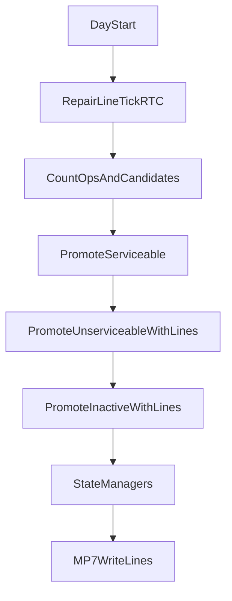

# MP7: архитектура ремонтных линий (baseline)

## Цель

Перевести квотирование ремонтов на MacroProperty‑линии без host‑логики в цикле и добавить выгрузку MP7 в ClickHouse. Линии используются при подтягивании `unserviceable` и `inactive` в `operations` по правилу минимального `free_days` при условии `free_days >= repair_time` и `aircraft_number == 0`.

## Данные MP7 (текущие линии)

MacroProperty (размер = `RTC_MAX_FRAMES`, активные линии `0..repair_quota_total-1`):
- `repair_line_idx[]` — индекс линии
- `repair_line_free_days[]` — накопленные дни с момента назначения линии
- `repair_line_aircraft_number[]` — `aircraft_number` занявшего линию (0 = свободна)

Связь с агентом:
- `repair_line_id` (agent variable) — линия, закреплённая за агентом
- `repair_line_assign_by_idx[]` — промежуточное назначение линии по `idx` для P2/P3
- `aircraft_number_by_idx[]` — снимок `aircraft_number` для поиска владельца линии

## Day‑0 и текущие ремонты

Линии инициализируются в RTC:
- Все линии: `idx=l`, `free_days=0`, `aircraft_number=0`
- Для агентов в `repair` (по `repair_state_buffer`): линия закрепляется и получает
  `aircraft_number` и `free_days=repair_days` (elapsed). Это позволяет освободить линию
  после достижения `repair_time` без host‑счётчиков.

## Обновление линий (RTC)

Каждый день (один агент `idx=0`):
- `free_days` инкрементируется для всех линий
- если линия занята (`aircraft_number != 0`) и `free_days >= repair_time` владельца,
  линия освобождается (`aircraft_number = 0`)

## Квотирование P2/P3 (без host)

Аллокатор выполняется RTC‑функцией (один агент `idx=0`):
1. Считает дефицит ops (учёт `approve_s3`, `approve_s7`).
2. Формирует список свободных линий, отсортированных по `free_days` (возрастающий).
3. Для каждого кандидата (idx desc):
   - проверяет окно `repair_day_count + repair_backfill`
   - выбирает первую линию, где `free_days >= repair_time`
   - назначает линию: `repair_line_assign_by_idx[idx] = line_id`,
     `repair_line_free_days[line_id]=0`, `repair_line_aircraft_number[line_id]=aircraft_number`
4. Apply‑слой ставит `intent_state=2` и записывает `repair_line_id`.

## MP7 выгрузка (ClickHouse)

История линий хранится в MP7 массиве:
- `mp7_line_free_days[day * RTC_MAX_FRAMES + line_id]`
- `mp7_line_aircraft_number[day * RTC_MAX_FRAMES + line_id]`

Таблицы:
- `sim_masterv2_repair_lines` — полная история
- `sim_masterv2_repair_lines_short` — только дни изменений

Колонки:
`version_date`, `version_id`, `day_u16`, `line_id`, `free_days`, `aircraft_number`

## Схема потока

