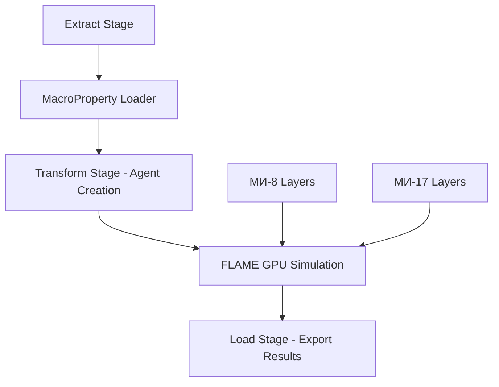
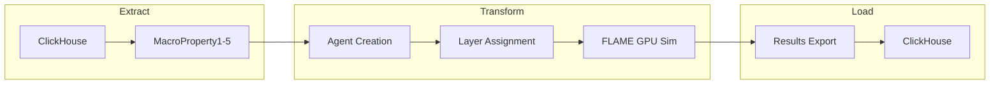
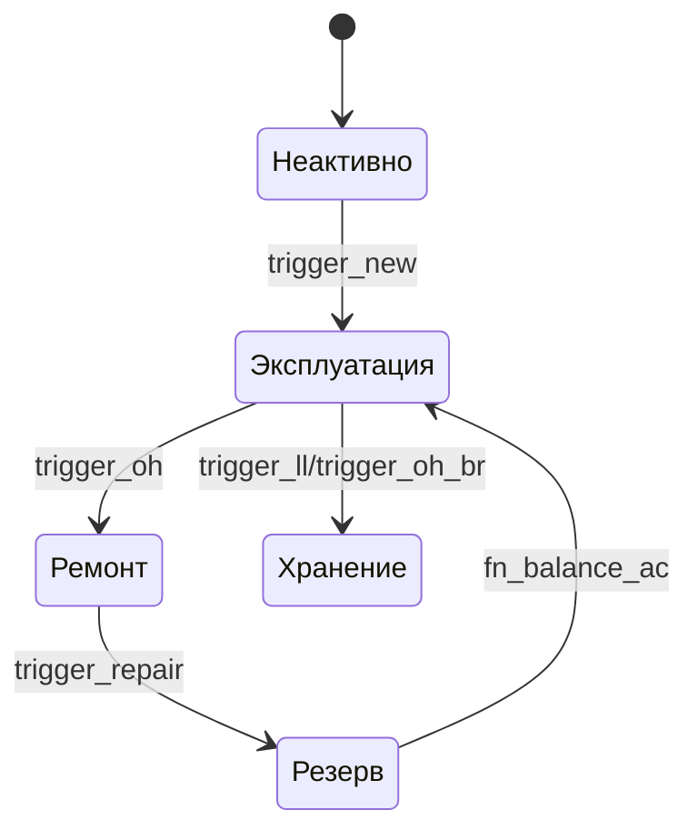
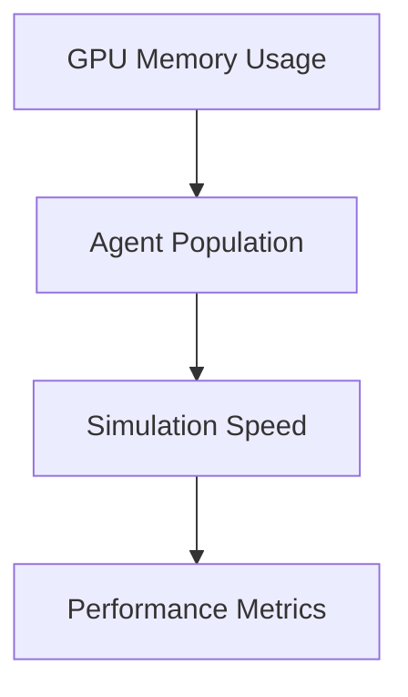

# 🎨 Настройка Визуализации Алгоритмов в Cursor AI

**Дата создания:** 25-01-2025  
**Последнее обновление:** 25-01-2025

## 🎯 **РЕКОМЕНДУЕМЫЙ СТЕК ВИЗУАЛИЗАЦИИ**

### **1. JSON Flow (уже установлено)**
- ✅ Превращает JSON конфигурации RTC в интерактивные графы
- ✅ Отлично для визуализации `rtc_fn_*.json`
- ✅ Просмотр зависимостей между триггерами

### **2. Mermaid в Cursor AI**
```markdown
# Пример диаграммы FLAME GPU архитектуры


### **3. LikeC4 для архитектурных диаграмм**
```
specification {
  element flame-gpu-system
  element etl-microservice
  element agent-layer
}

model {
  FlameGPU = flame-gpu-system 'FLAME GPU Core' {
    description "GPU-accelerated agent simulation"
    technology "CUDA, pyflamegpu"
  }
  
  ExtractStage = etl-microservice 'Extract Stage' {
    description "Data loading from ClickHouse"
  }
  
  MILayers = agent-layer 'МИ-8/МИ-17 Layers' {
    description "Agent state layers by aircraft type"
  }
}
```

## 🔧 **УСТАНОВКА РАСШИРЕНИЙ**

### **Обязательные расширения Cursor:**
1. **JSON Flow** ✅ (уже установлено)
2. **Mermaid Preview** 
3. **LikeC4 Viewer**
4. **PlantUML** (опционально)

### **Команда установки:**
```bash
# В терминале Cursor
code --install-extension bierner.markdown-mermaid
code --install-extension likec4.likec4-vscode
```

## 📊 **ПРИМЕНЕНИЕ К НАШЕМУ ПРОЕКТУ**

### **1. Визуализация RTC JSON конфигураций**
```javascript
// Используйте JSON Flow для просмотра:
// data_input/analytics/rtc_fn_ops_ac.json
// data_input/analytics/rtc_fn_balance_ac.json
```

### **2. Диаграмма ETL архитектуры**


### **3. Схема RTC триггеров**


## 🚀 **WORKFLOW ВИЗУАЛИЗАЦИИ**

### **Шаг 1: JSON Flow для RTC**
1. Откройте `rtc_fn_ops_ac.json`
2. Нажмите на иконку JSON Flow
3. Изучите интерактивный граф триггеров

### **Шаг 2: Mermaid для архитектуры**
1. Создайте `.md` файл с mermaid блоками
2. Используйте Mermaid Preview
3. Экспортируйте в PNG/SVG

### **Шаг 3: LikeC4 для системной архитектуры**
1. Создайте `.likec4` файл
2. Опишите компоненты системы
3. Генерируйте архитектурные диаграммы

## 📁 **СТРУКТУРА ПАПОК**

```
docs/
├── diagrams/
│   ├── etl_architecture.mermaid
│   ├── rtc_state_machine.mermaid
│   └── flame_gpu_layers.likec4
├── flowcharts/
│   ├── agent_lifecycle.png
│   └── microservice_flow.svg
└── visualization_setup.md
```

## 🎛️ **НАСТРОЙКИ CURSOR**

Добавьте в `settings.json`:
```json
{
  "mermaid.theme": "default",
  "likec4.preview.theme": "dark",
  "json.schemas": [
    {
      "fileMatch": ["rtc_*.json"],
      "url": "./schema/rtc_schema.json"
    }
  ]
}
```

## ⚡ **АВТОМАТИЗАЦИЯ ДИАГРАММ**

Создайте Cursor Rules для автогенерации:
```markdown
---
description: Automatically generate Mermaid diagrams for new RTC functions
globs: data_input/analytics/rtc_*.json
alwaysApply: false
---

When creating or updating RTC JSON configs, automatically generate corresponding Mermaid state diagrams showing trigger flows and status transitions.
```

## 🔄 **ИНТЕГРАЦИЯ С FLAME GPU**

### **Визуализация Environment Property Arrays:**
```python
# В Python скриптах добавить экспорт диаграмм
def export_agent_flow_diagram():
    mermaid_code = generate_mermaid_from_rtc_config()
    with open('docs/diagrams/current_simulation.mermaid', 'w') as f:
        f.write(mermaid_code)
```

## 📈 **МОНИТОРИНГ ПРОИЗВОДИТЕЛЬНОСТИ**

Визуализируйте метрики FLAME GPU:


## 🎯 **ЗАКЛЮЧЕНИЕ**

**Используйте комбинацию:**
- 🔗 **JSON Flow** для RTC конфигураций  
- 📊 **Mermaid** для процессов и состояний
- 🏗️ **LikeC4** для архитектуры системы
- 🤖 **AI-генерация** диаграмм через Cursor

Это даст вам полный контроль над визуализацией без необходимости "рисовать самим"!